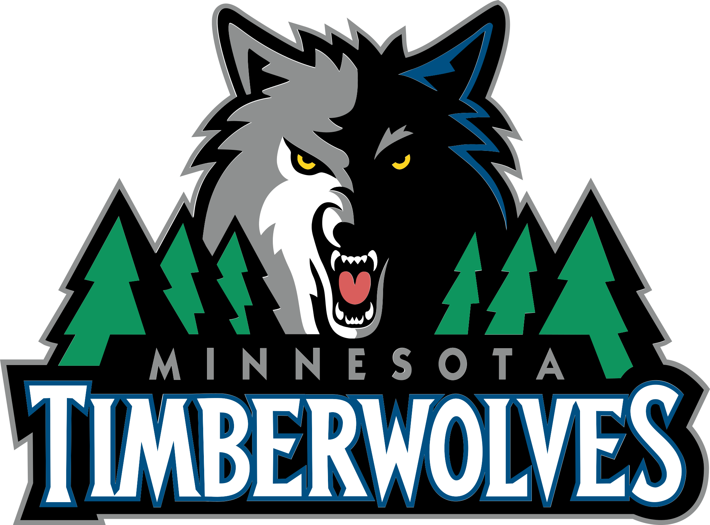
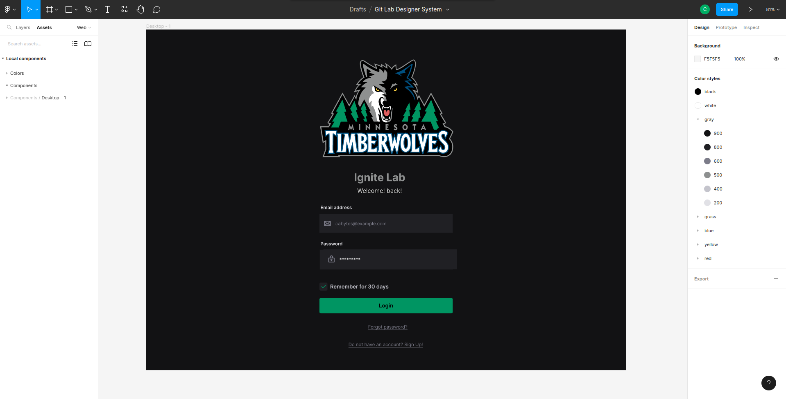
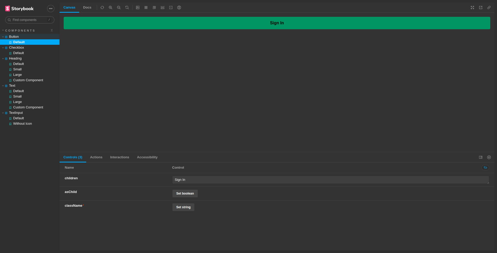
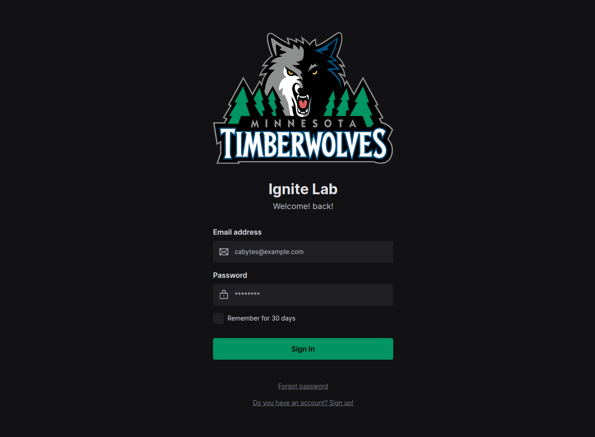

#
<p align="center">
    
</p>
<h1 align="center">Ignite Lab</h1>


<p align="center">
  <a href="#rocket-tecnologias">Tecnologias</a>&nbsp;&nbsp;&nbsp;|&nbsp;&nbsp;&nbsp;
  <a href="#-projeto">Projeto</a>&nbsp;&nbsp;&nbsp;|&nbsp;&nbsp;&nbsp;
  <a href="#-layout">Layout</a>&nbsp;&nbsp;&nbsp;|&nbsp;&nbsp;&nbsp;
</p>
<br>

<p align="center">
    
    
    
</p>

---
## 🚀 Technologies ##

This project was developed using the following technologies:

- [React](https://pt-br.reactjs.org/)
- [Vite](https://vitejs.dev/)
- [TypeScript](https://www.typescriptlang.org/)
- [Tailwind](https://tailwindcss.com/)
- [Storybook](https://storybook.js.org/)
- [Radix](https://www.radix-ui.com/)
- [Phosphor](https://phosphoricons.com/)
<br>

---

## 📋  Requirements ##

Before starting you need :checkered_flag:, have installed the [Git](https://git-scm.com) e [Node](https://nodejs.org/en/).

<br>

---
## ⌨ How to run the project ##

```bash
# Clone this project
$ git clone git@github.com:Ca-byte/design_system_ignite_lab.git

# Access
$ cd lab-ds

# Install dependencies
$ npm i

# Run the project
$ npm run dev

# The server will initialize in the <http://localhost:5173/>

#storybook
$ npm run storybook
```
<br>

---

## 💻 Project

We create a web layout using Figma and we could learn how to create components with variable there, after that with storybook we recreate our components with their variables, in the end we build the interface using all components listed on storybook and deploy the application.

This is a project developed during  **[Ignite Lab](https://lp.rocketseat.com.br/inscricao/ignite-lab/)**, run by **[@Rocketseat](https://github.com/Rocketseat)** during the October 10, 11 and 12 2022.

<br>

---

## 🔖 Layout ##

You can view the layout of the project through the links below:
I made my version of colors and components, my logo [I found here](https://worldvectorlogo.com/). Feel free to duplicate and abuse of your creativity.

- [Ignite Lab](https://www.figma.com/file/o2gXVeqdIB7eBWmH6njvye/Git-Lab-Designer-System?node-id=0%3A1)

Remembering that you need to have a [Figma](http://figma.com/) account to access it.


---


<br>
<p align="center">Developed with 💜 by Caroline Vieira</p>
